# CepBorsa

Halka arz hisseleri takibi, döviz çevirme ve finans bot özelliğine sahip mobil uygulama projesidir.

## ⚙️ Özellikler

- 🔒 Kullanıcı kaydı ve giriş
- 🔑 Şifremi Unuttum, Şifre Değiştir
- 💹 Halka arz hisse takibi
- 💬 Halka arz hisseleri üzerinde sohbet başlatabilme
- ❤️ Halka arz favori listesi
- 💶 Altın, gümüş, dolar, euro döviz dönüşümleri, anlık döviz takibi. 
- 🤖 Finans alanındaki sorulara cevap veren CepBorsa BOT 
- 👤 Profil özelleştirmeleri (ad, soyad, fotoğraf)
- 🌓 Koyu, açık mod desteği
- 🈯 Çoklu dil desteği (İngilizce, Türkçe)

## 🛠️ Kullanılan Teknolojiler

- React Native
- Typescript
- Firebase Auth
- Context API
- React Navigation

## 📸 Ekran Görüntüleri


<!-- Satır 1 -->
<p align="center">
  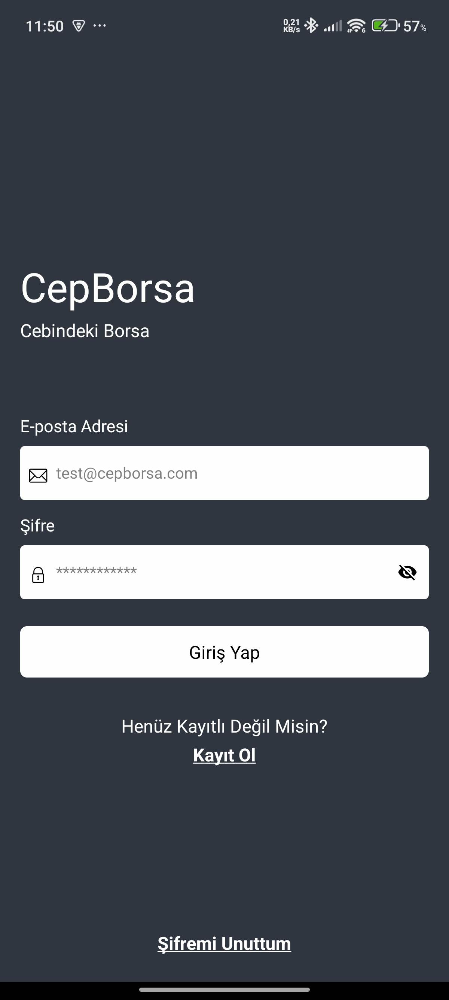
  &nbsp;&nbsp;&nbsp;&nbsp;&nbsp;&nbsp;
  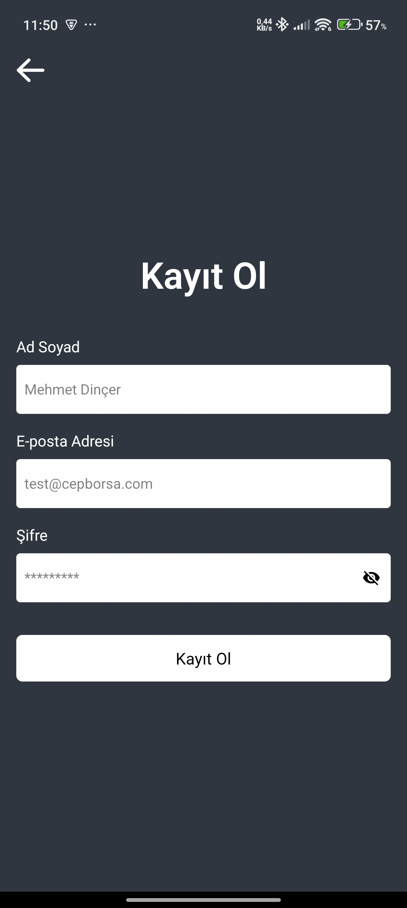
  &nbsp;&nbsp;&nbsp;&nbsp;&nbsp;&nbsp;
  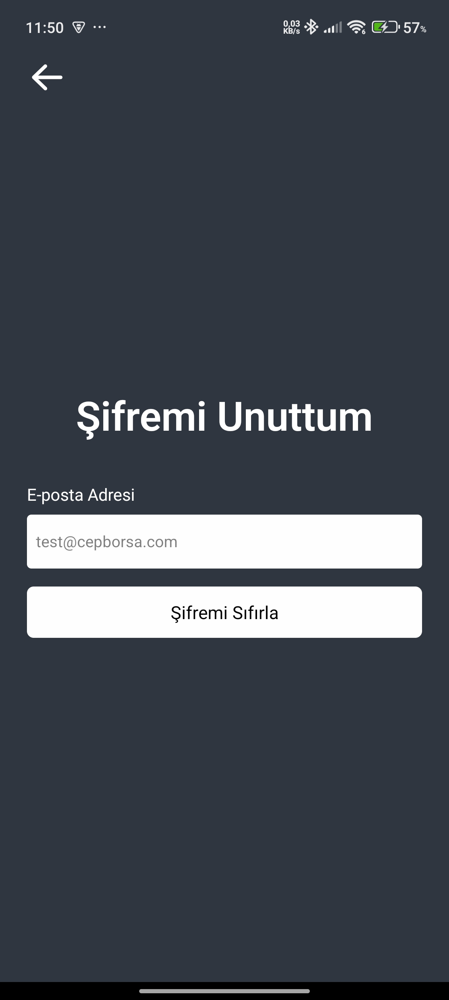
</p>

<!-- Satır 2 -->
<p align="center">
  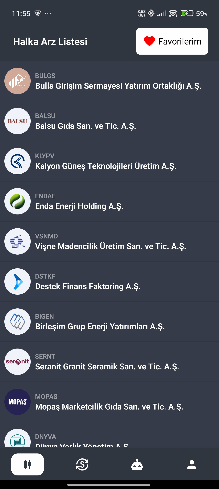
  &nbsp;&nbsp;&nbsp;&nbsp;&nbsp;&nbsp;
  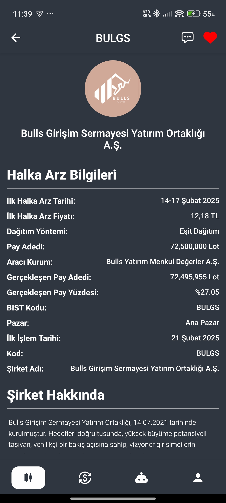
  &nbsp;&nbsp;&nbsp;&nbsp;&nbsp;&nbsp;
  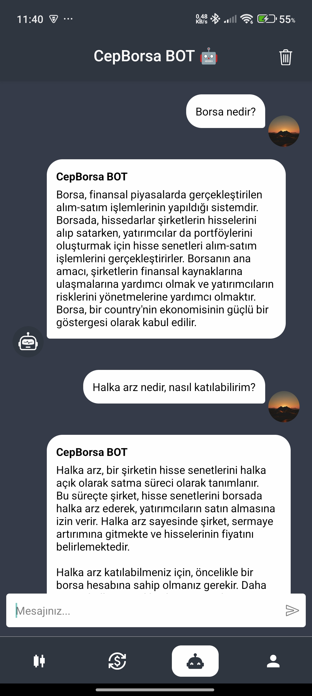
</p>


<!-- Satır 3 -->
<p align="center">
  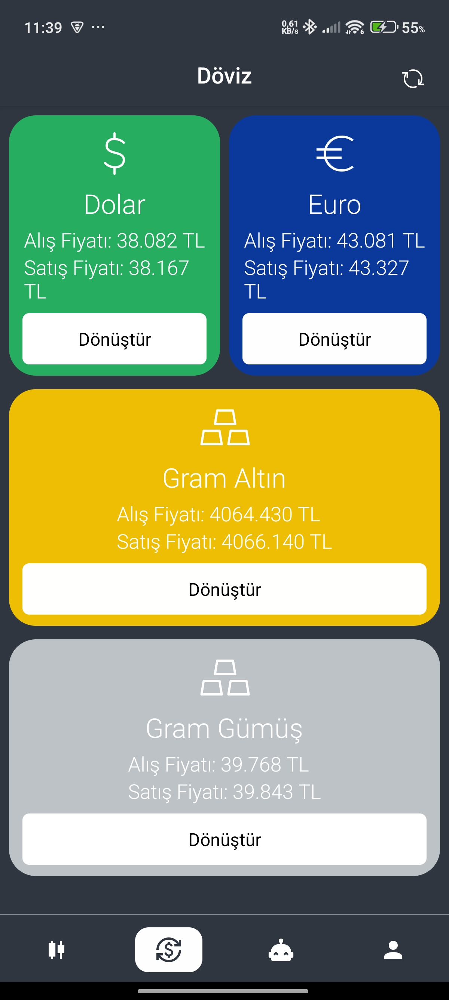
  &nbsp;&nbsp;&nbsp;&nbsp;&nbsp;&nbsp;
  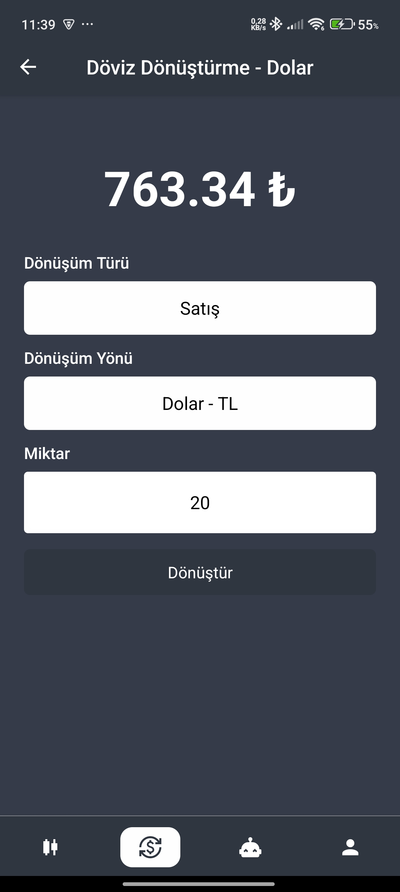
  &nbsp;&nbsp;&nbsp;&nbsp;&nbsp;&nbsp;
  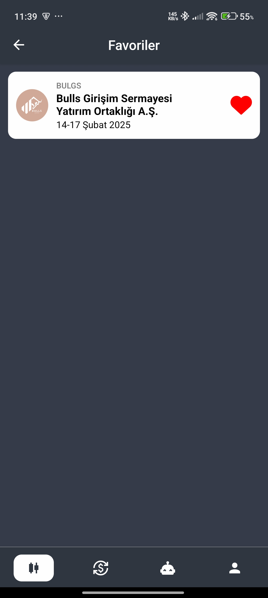
</p>

<!-- Satır 4 -->
<p align="center">
  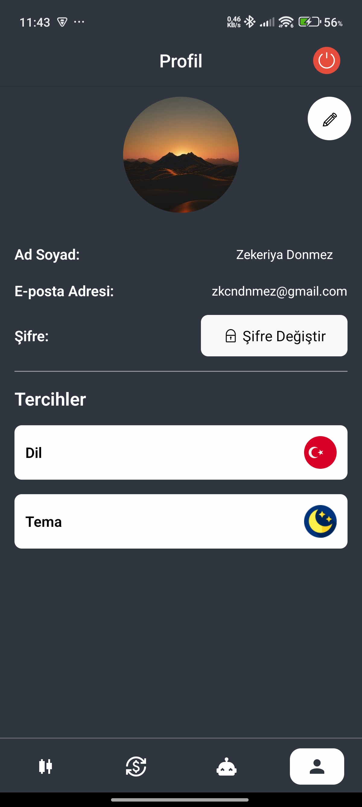
  &nbsp;&nbsp;&nbsp;&nbsp;&nbsp;&nbsp;
  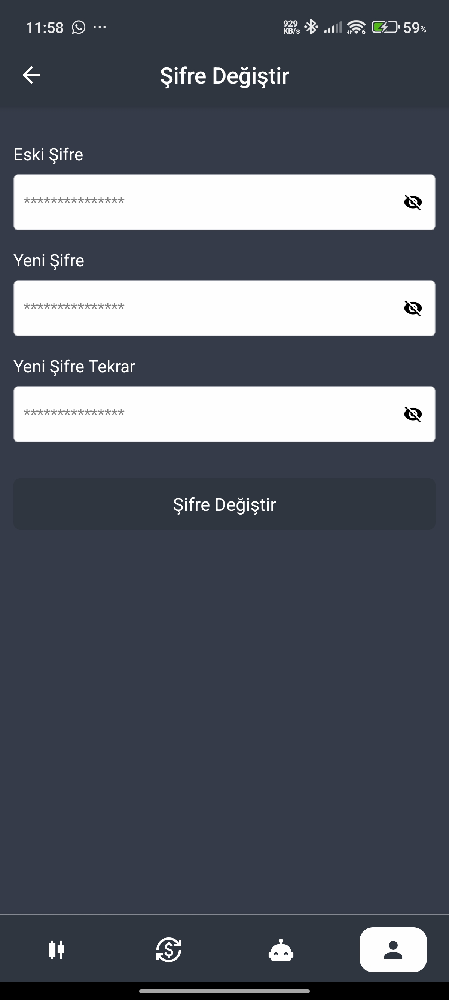
</p>


## ⚙️ Kurulum

1. Projeyi klonlayın ve proje dizinine gidin:

   ```bash
   git clone https://github.com/Zecky-dev/CepBorsa.git
   
   cd CepBorsa
   ````

2. Gerekli Bağımlılıkların Kurulumu

   ```bash
   npm install
   ```

3. Projeyi Çalıştırma
   
   ```bash
   # Android veya iOS'ta çalıştırma

   npx react-native run-android # Android için
   npx react-native run-ios # iOS için
   ```

## ‼️ NOT

Uygulama varsayılan olarak yerel (localhost) backend ile çalışacak şekilde ayarlanmıştır.

Eğer uygulamayı uzaktaki backend ile çalıştırmak istiyorsanız, aşağıdaki adımı uygulamanız yeterlidir:

`./src/constants/index.ts` dosyasını açın ve aşağıdaki satırı:

`const BASE_URL = createBaseURL()` şununla değiştirin:

`const BASE_URL = "https://cepborsabackend.onrender.com/api`

böylece hatasız şekilde istekleri atabilirsiniz.


## 📬 Geri Bildirim

Her türlü öneri ve geri bildirim için: [ceng.zekeriyadonmez@gmail.com](mailto:ceng.zekeriyadonme@gmail.com)


   


